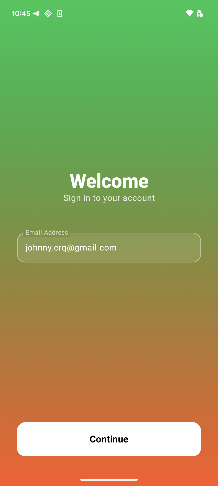
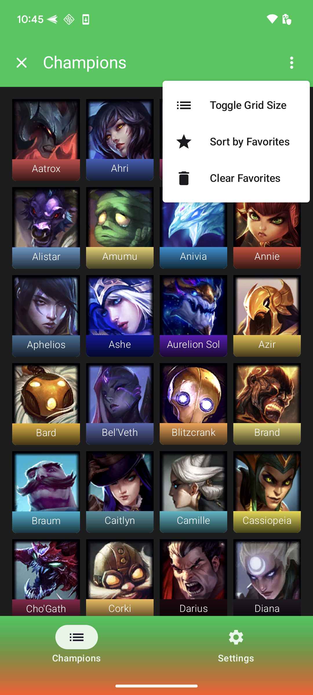
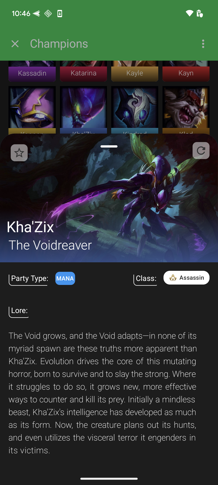

# CompanionLolApp
CompanionLolApp is a modern Android showcase application designed to demonstrate the latest technologies, architectural patterns, and best practices in Android development. It serves as a comprehensive portfolio, focusing on clean code, modularization, and advanced Jetpack libraries. This is a work-in-progress.

## 📱 About the App
The application is a League of Legends companion tool that allows users to explore champion data. It fetches information from the Riot Games Data Dragon API, providing an offline-first experience through local caching and periodic background synchronization.

## 🛠 Tech Stack
This project leverages the cutting-edge Android ecosystem:

- **UI Framework**: [Jetpack Compose](https://developer.android.com/jetpack/compose) with [Material 3](https://m3.material.io/) for a modern, declarative UI.
- **Architecture**: Multi-module architecture following Clean Architecture principles (App, Data, Network, Storage).
- **Dependency Injection**: [Hilt](https://developer.android.com/training/dependency-injection/hilt-android) for robust and testable DI.
- **Navigation**: [Navigation 3](https://developer.android.com/guide/navigation/navigation-3) (Experimental) showcasing the future of Android navigation.
- **Database**: [SQLDelight](https://cashapp.github.io/sqldelight/) for typesafe local storage.
- **Networking**: [Retrofit](https://square.github.io/retrofit/) with [Kotlin Serialization](https://kotlinlang.org/docs/serialization.html).
- **Background Tasks**: [WorkManager](https://developer.android.com/topic/libraries/architecture/workmanager) for reliable periodic data synchronization.
- **Image Loading**: [Coil](https://coil-kt.github.io/coil/) with integrated [Palette API](https://developer.android.com/training/material/palette-colors) support for dynamic UI coloring.
- **Logging**: [Timber](https://github.com/JakeWharton/timber).
- **Static Analysis**: [Detekt](https://detekt.dev/) and [Spotless](https://github.com/diffplug/spotless) (ktfmt) to ensure code quality and consistency.
- **Build System**: Gradle Kotlin DSL with Version Catalogs for centralized dependency management.

## ⚙️ Configuration
To build and run the application, you must provide a Riot Games API key.

1.  Visit the [Riot Games Developer Portal](https://developer.riotgames.com/) and obtain an API key.
2.  Open (or create) the `local.properties` file in your project's root directory.
3.  Add your API key using the following property:
    ```properties
    riotApiKey="YOUR_API_KEY_HERE"
    ```

## 📸 Screenshots
The following screenshots demonstrate the core functionality and design of the app:

| Login & Logout |                         Champion List                           |                       Champion Details                        |
| :---: |:---------------------------------------------------------------:|:-------------------------------------------------------------:|
|  |  |  |
| *Basic Login Logout feature.* |     *Browsing all available champions with a smooth scrolling experience.*     |                 *Detailed view of champion stats, lore, and abilities.*                 |

--- 

> [!NOTE]
> This is an **in-progress project** specifically created to showcase the latest Android tech stacks and best practices. It is continuously updated to reflect evolving industry standards.
